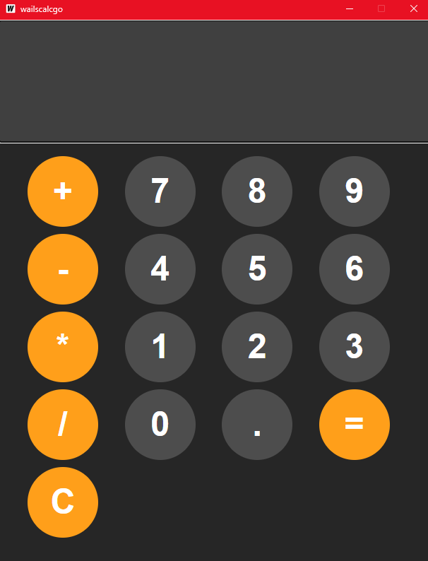

# wailscalcgo

This is a very basic calculator application created to test out the Wails library in Golang. It performs basic arithmetic operations such as addition, subtraction, multiplication, and division.

## Getting Started

To run the calculator, you will need to have the following installed:

* Golang
* Wails

Once you have these installed, you can clone this repository and run the following command to start the application:

This will start the calculator application and open a window where you can enter numbers and perform calculations.

## Usage

The calculator can be used by entering numbers and operators into the text field and then clicking the appropriate button. The following operators are supported:

* `+` for addition
* `-` for subtraction
* `*` for multiplication
* `/` for division

You can also use the following buttons:

* `C` to clear the text field
* `=` to evaluate the expression in the text field

## Features

* Performs basic arithmetic operations (addition, subtraction, multiplication, and division)
* Clear button to clear the input field
* Evaluate button to calculate the expression

## Limitations

* This is a very basic calculator and does not support any advanced features such as trigonometry, logarithms, or scientific notation.
* The calculator only supports integer and float numbers.

## Future Development

* Add support for more advanced operations
* Improve the user interface

## Contributing

If you would like to contribute to this project, please feel free to fork the repository and submit a pull request.

## License

This project is licensed under the MIT License. See the LICENSE file for more information.
